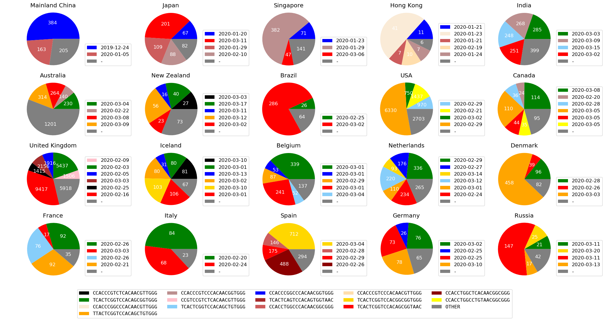
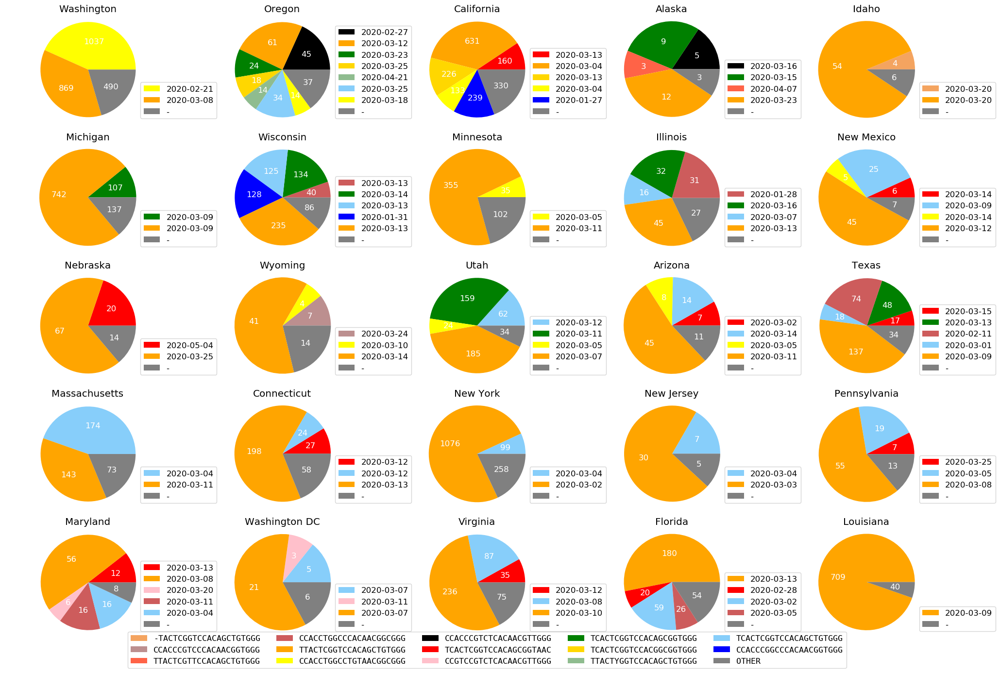
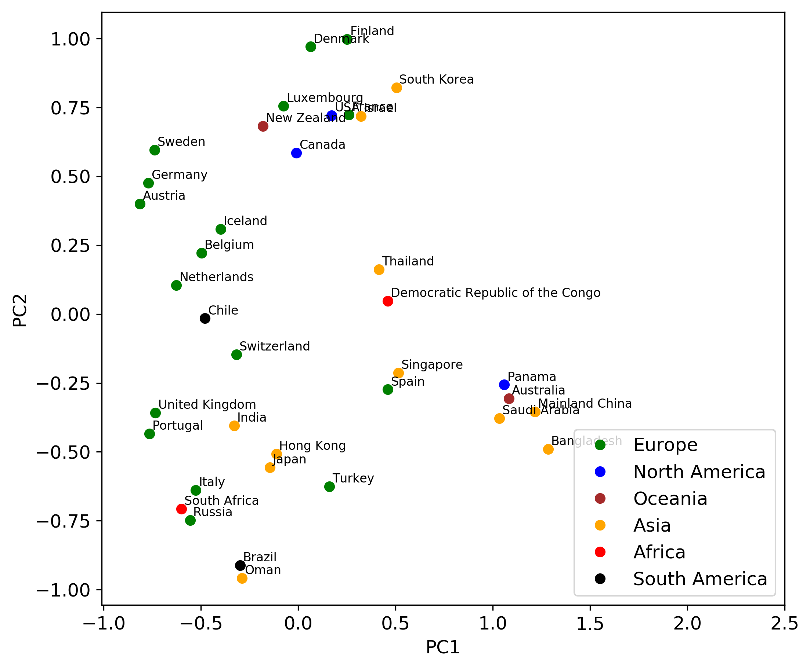
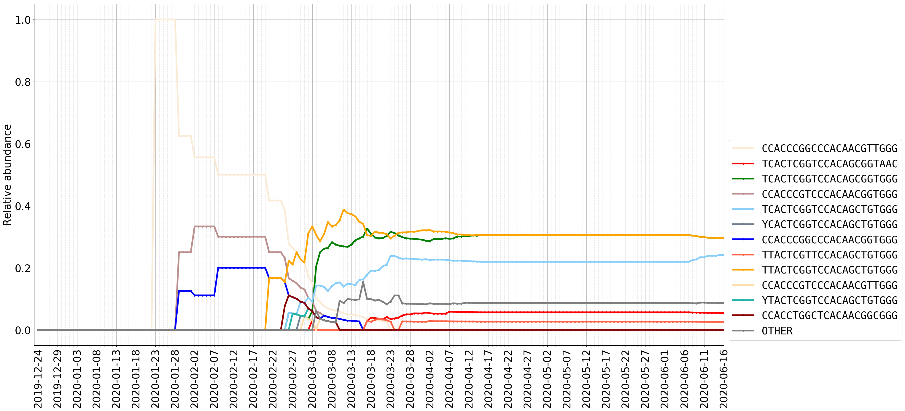
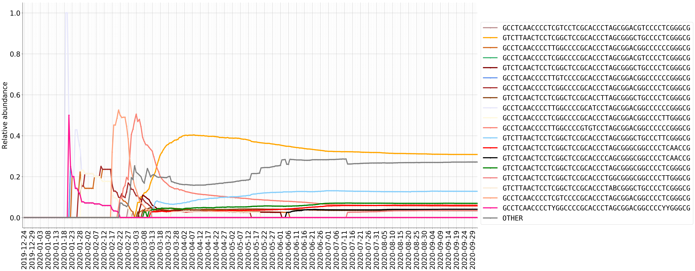

# Informative Subtype Marker (ISM) Analysis Report
Informative Subtype Marker (ISM) is an efficient framework for genetic subtyping of a pandemic virus and implement it for SARS-CoV-2, the novel coronavirus that causes COVID-19.        
Drexel University EESI Lab, 2020        
Maintainer: Zhengqiao Zhao, zz374 at drexel dot edu  
Owner: Gail Rosen, gailr at ece dot drexel dot edu  

**Report created on 2020/07/29**

<!--- dividing line --->

## Abstract
The novel coronavirus responsible for COVID-19, SARS-CoV-2, expanded to reportedly 8.7 million confirmed cases worldwide by June 21, 2020. The global SARS-CoV-2 pandemic highlights the importance of tracking viral transmission dynamics in real-time. Through June 2020, researchers have obtained genetic sequences of SARS-CoV-2 from over 50 thousand samples from infected individuals worldwide. Since the virus readily mutates, each sequence of an infected individual contains useful information linked to the individual's exposure location and sample date. But, there are over 30,000 bases in the full SARS-CoV-2 genome, so tracking genetic variants on a whole-sequence basis becomes unwieldy. *ncov_ism* is a method to instead efficiently identify and label genetic variants, or "subtypes" of SARS-CoV-2. This method defines a compact set of nucleotide sites that characterize the most variable (and thus most informative) positions in the viral genomes sequenced from different individuals, called an Informative Subtype Marker or *ISM*. This tool defines viral subtypes for each ISM, and analyze the regional distribution of subtypes to track the progress of the pandemic.

## Entropy of viral sequences

<!---  --->

## ISM positions
Mapping ISM sites to the reference viral genome

<!--- annotation table start --->
<table border="1" class="dataframe">
  <thead>
    <tr style="text-align: right;">
      <th>Ref position</th>
      <th>Entropy</th>
      <th>Gene</th>
      <th>Is silent</th>
    </tr>
  </thead>
  <tbody>
    <tr>
      <td>241</td>
      <td>0.800329</td>
      <td>NaN</td>
      <td>True</td>
    </tr>
    <tr>
      <td>1059</td>
      <td>0.696990</td>
      <td>YP_009724389.1: ORF1ab polyprotein</td>
      <td>False</td>
    </tr>
    <tr>
      <td>2480</td>
      <td>0.203429</td>
      <td>YP_009724389.1: ORF1ab polyprotein</td>
      <td>False</td>
    </tr>
    <tr>
      <td>2558</td>
      <td>0.211935</td>
      <td>YP_009724389.1: ORF1ab polyprotein</td>
      <td>False</td>
    </tr>
    <tr>
      <td>3037</td>
      <td>0.809719</td>
      <td>YP_009724389.1: ORF1ab polyprotein</td>
      <td>True</td>
    </tr>
    <tr>
      <td>8782</td>
      <td>0.373532</td>
      <td>YP_009724389.1: ORF1ab polyprotein</td>
      <td>True</td>
    </tr>
    <tr>
      <td>10097</td>
      <td>0.258352</td>
      <td>YP_009724389.1: ORF1ab polyprotein</td>
      <td>False</td>
    </tr>
    <tr>
      <td>11083</td>
      <td>0.548512</td>
      <td>YP_009724389.1: ORF1ab polyprotein</td>
      <td>False</td>
    </tr>
    <tr>
      <td>14408</td>
      <td>0.810519</td>
      <td>YP_009724389.1: ORF1ab polyprotein</td>
      <td>False</td>
    </tr>
    <tr>
      <td>14805</td>
      <td>0.440797</td>
      <td>YP_009724389.1: ORF1ab polyprotein</td>
      <td>True</td>
    </tr>
    <tr>
      <td>17747</td>
      <td>0.204429</td>
      <td>YP_009724389.1: ORF1ab polyprotein</td>
      <td>False</td>
    </tr>
    <tr>
      <td>17858</td>
      <td>0.201251</td>
      <td>YP_009724389.1: ORF1ab polyprotein</td>
      <td>False</td>
    </tr>
    <tr>
      <td>18060</td>
      <td>0.207303</td>
      <td>YP_009724389.1: ORF1ab polyprotein</td>
      <td>True</td>
    </tr>
    <tr>
      <td>20268</td>
      <td>0.311290</td>
      <td>YP_009724389.1: ORF1ab polyprotein</td>
      <td>True</td>
    </tr>
    <tr>
      <td>23403</td>
      <td>0.806717</td>
      <td>YP_009724390.1: surface glycoprotein</td>
      <td>False</td>
    </tr>
    <tr>
      <td>23731</td>
      <td>0.256187</td>
      <td>YP_009724390.1: surface glycoprotein</td>
      <td>True</td>
    </tr>
    <tr>
      <td>25563</td>
      <td>0.797292</td>
      <td>YP_009724391.1: ORF3a protein</td>
      <td>False</td>
    </tr>
    <tr>
      <td>26144</td>
      <td>0.392083</td>
      <td>YP_009724391.1: ORF3a protein</td>
      <td>False</td>
    </tr>
    <tr>
      <td>28144</td>
      <td>0.373454</td>
      <td>YP_009724396.1: ORF8 protein</td>
      <td>False</td>
    </tr>
    <tr>
      <td>28881</td>
      <td>0.908799</td>
      <td>YP_009724397.2: nucleocapsid phosphoprotein</td>
      <td>False</td>
    </tr>
    <tr>
      <td>28882</td>
      <td>0.907944</td>
      <td>YP_009724397.2: nucleocapsid phosphoprotein</td>
      <td>True</td>
    </tr>
    <tr>
      <td>28883</td>
      <td>0.905213</td>
      <td>YP_009724397.2: nucleocapsid phosphoprotein</td>
      <td>False</td>
    </tr>
  </tbody>
</table>
<!--- annotation table end --->

<!--- dividing line --->

## ISM distribution worldwide
The following figure shows the major ISMs in selective countries/regions (in the legend next to each
country/region, we show the date when a major ISM was first sequenced in that country/region). 
ISMs with less than 5% abundance are plotted as “OTHER”. 



<!---  --->

## ISM distribution in US
The following figure shows the ISM distribution in the United States in 25 states. ISMs with less than 5% abundance are plotted as “OTHER”. 



<!---  --->

## ISM abundance PCA analysis
ISM abundance table is constructed for regions with more than 150 submissions. We then visualize the pattern of viral genetic variation by the first two principle components of the pairwise Bray-Curtis dissimilarity matrix between regions. Regions with similar genetic variation pattern are grouped together in the PCA plot.




## The dynamic of ISM in different locations
1. The relative abundance (%) of ISMs in DNA sequences from Mainland China as sampled over time.


2. The relative abundance (%) of ISMs in DNA sequences from Mainland China as sampled over time.



3. The relative abundance (%) of ISMs in DNA sequences from Mainland China as sampled over time.


<!---  --->

## Reference
Preprint in BioRxiv [Characterizing geographical and temporal dynamics of novel coronavirus SARS-CoV-2 using informative subtype markers](https://www.biorxiv.org/content/10.1101/2020.04.07.030759v5)
If you find our work helpful, please cite:
```
@article {Zhao2020.04.07.030759,
	author = {Zhao, Zhengqiao and Sokhansanj, Bahrad A. and Malhotra, Charvi and Zheng, Kitty and Rosen, Gail L.},
	title = {Genetic Grouping of SARS-CoV-2 Coronavirus Sequences using Informative Subtype Markers for Pandemic Spread Visualization},
	elocation-id = {2020.04.07.030759},
	year = {2020},
	doi = {10.1101/2020.04.07.030759},
	publisher = {Cold Spring Harbor Laboratory},
	URL = {https://www.biorxiv.org/content/early/2020/07/10/2020.04.07.030759},
	eprint = {https://www.biorxiv.org/content/early/2020/07/10/2020.04.07.030759.full.pdf},
	journal = {bioRxiv}
}

```
## Acknowledgement
We would like to thank [GISAID](www.gisaid.org) for sharing the sequence data and metadata. We also gratefully acknowledge the authors, originating and submitting laboratories of the sequences from GISAID’s EpiFlu Database on which this research is based. The list is detailed in [here](acknowledgement_table.csv). All submitters of data may be contacted directly via the [GISAID](www.gisaid.org) website.
